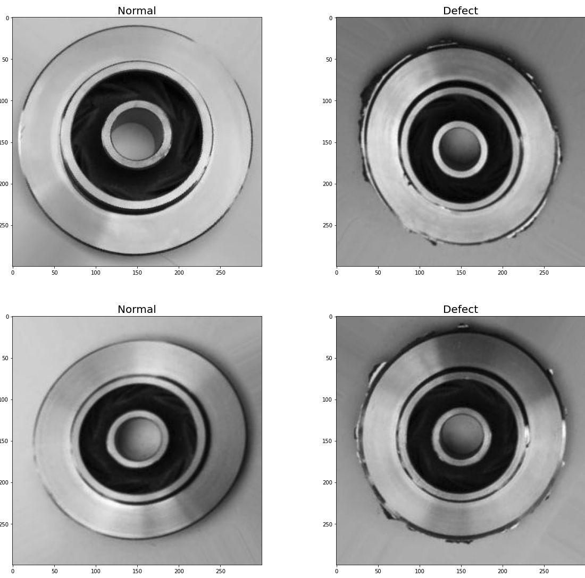
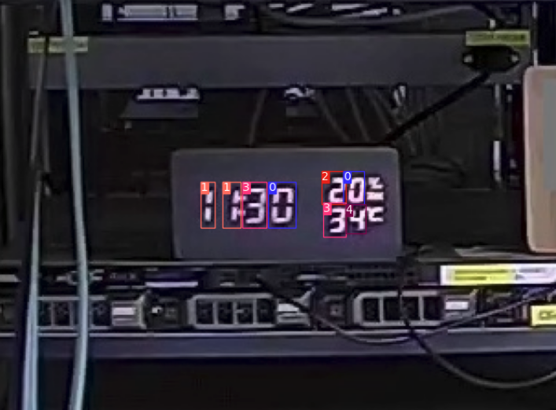
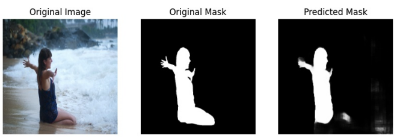
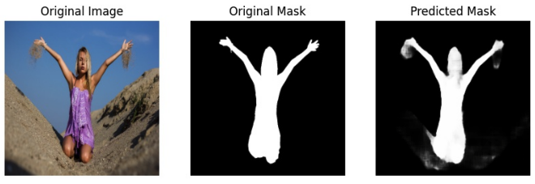
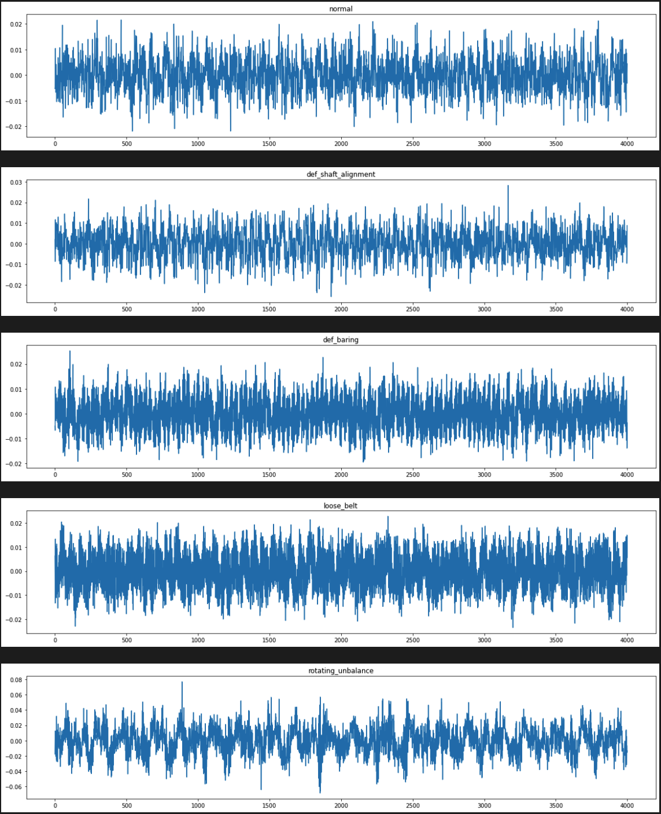

# IoT AI model project
  - IoT 데이터를 활용한 AI 모델 개발 프로젝트 입니다.
  - Target Device : Nivida jetson TX2 (4GB)
  - 학습머신에서는 Pytorch, Tensorflow로 모델 개발 및 학습하고 ONNX로 전환하며, 최종적으로 Jetson TX2에서 ONNX를 TensorRT 모델로 전환하여 사용합니다.
  - 공개된 학습데이터셋을 활용하며, 본 프로젝트 코드에는 데이터셋은 포함되어 있지 않습니다. (아래 링크를 따라 별도로 다운로드)
 
## 이미지 분류 모델

#### 1. Inception v4
  - 목적 : 주조 제품의 불량 검출 (Classification, 클래스 2종)
  - 학습 데이터 : 224x224 이미지, 5만장
    - https://www.kaggle.com/datasets/ravirajsinh45/real-life-industrial-dataset-of-casting-product
  - 목표 성능치 : 8.8 fps, F1-Score 90%
  - Refercences
    - [Inception-v4, Inception-ResNet and the Impact of Residual Connections on Learning, 2016](https://arxiv.org/abs/1602.07261)

   
  
#### 2. ResNet50
  - 목적 : 주조 제품의 불량 검출 (Classification, 클래스 2종)
  - 학습 데이터 : 224x224 이미지, 5만장
    - https://www.kaggle.com/datasets/ravirajsinh45/real-life-industrial-dataset-of-casting-product
  - 목표 성능치 : 28.8 fps, F1-Score 90%
  - Refercences
    - [Deep Residual Learning for Image Recognition, 2015](https://arxiv.org/abs/1512.03385)

   

## 객체 인식 모델

#### 3. SSD ResNet18
  - 목적 : 디지털 배전판, 계기판 숫자 인식 (Text recongnition)
  - 학습 데이터 : 서버실 디지털 온도계, 습도계, 시계, 디지털 카운터
    - https://www.kaggle.com/datasets/keshavaprasad/svhnvocyolodigitdetector?resource=download
  - 목표 성능치 : 12.8 fps, mAP@0.75 90%
  - Refercences
    - [Deep Residual Learning for Image Recognition, 2015](https://arxiv.org/abs/1512.03385)
    - [SSD: Single Shot MultiBox Detector, 2015](https://arxiv.org/abs/1512.02325)
  
   

#### 4.Yolo3
  - 목적 : 디지털 배전판, 계기판 숫자 인식 (Text recongnition)
  - 학습 데이터 : 서버실 디지털 온도계, 습도계, 시계, 디지털 카운터
    - https://www.kaggle.com/datasets/keshavaprasad/svhnvocyolodigitdetector?resource=download  
  - 목표 성능치 : 20 fps, mAP@0.75 90%
 - Refercences
    - [YOLO: Real-Time Object Detection](https://pjreddie.com/darknet/yolo/)
    - [YOLOv3: An Incremental Improvement, 2018](https://arxiv.org/abs/1804.02767)

    

## 이미지 분할 모델 (Image Segmentation)

#### 5. Unet
  - 목적 : 이미지 내의 사람 영역 인식
  - 학습 데이터 : 다양한 크기와 자세인 사람(전신, 상반신) 이미지 (supervisely human)
    - https://www.kaggle.com/datasets/tapakah68/supervisely-filtered-segmentation-person-dataset
  - 목표 성능치 : 13.5 fps, Dice coefficient 90%
 - Refercences
    - [U-Net: Convolutional Networks for Biomedical Image Segmentation, 2015](https://arxiv.org/abs/1505.04597)

   
   

## 시계열 분류 모델

#### 6. LSTM
  - 목적 : 3상 모터의 전류 데이터 기반 이상 감지 (Classification, 클래스 5종)
  - 학습 데이터 : 지하철 환풍구 3상모터의 전류 데이터 
    - https://aihub.or.kr/aihubdata/data/view.do?currMenu=116&topMenu=100&aihubDataSe=ty&dataSetSn=238
  - 목표 성능치 : F1-Score 90% 
  
   

#### 7. RNN
  - 목적 : 3상 모터의 진동 데이터 기반 이상 감지 (Classification, 클래스 5종)
  - 학습 데이터 : 지하철 환풍구 3상모터의 진동 데이터 
    - https://aihub.or.kr/aihubdata/data/view.do?currMenu=116&topMenu=100&aihubDataSe=ty&dataSetSn=238
  - 목표 성능치 : F1-Score 90%

   
